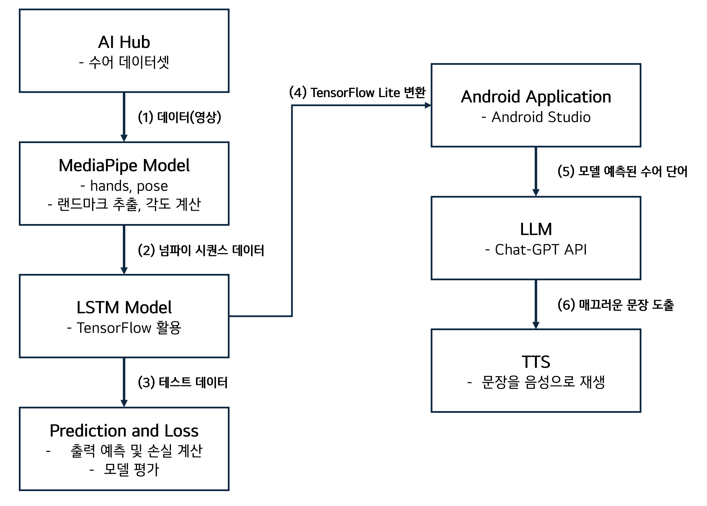
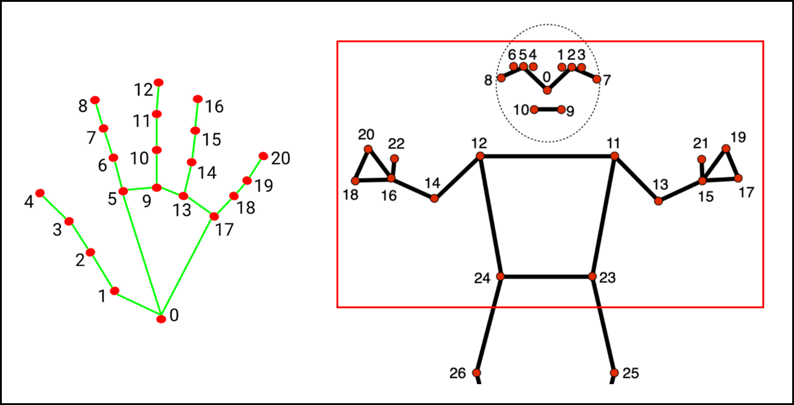
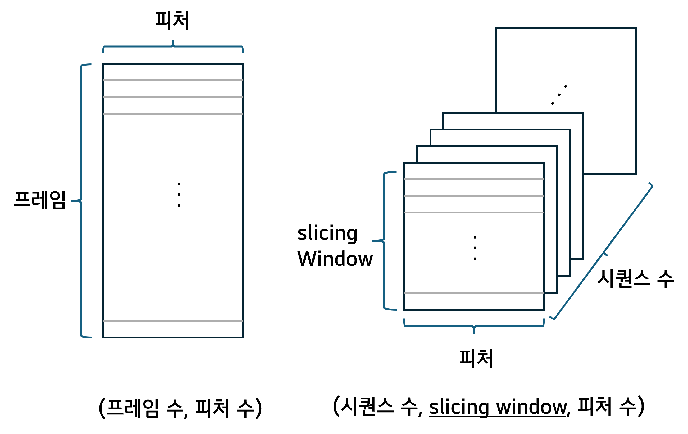
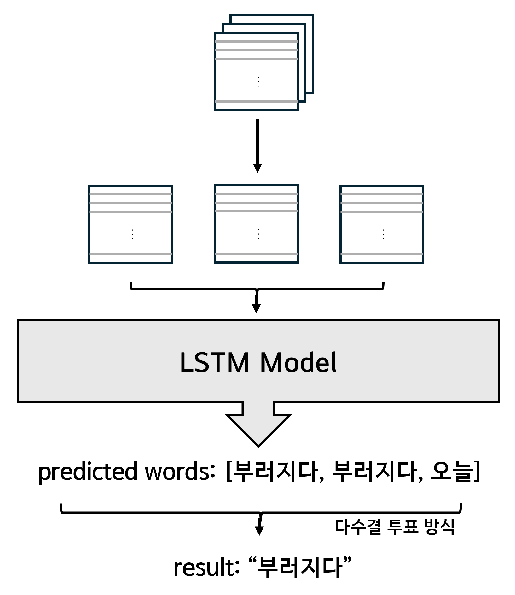
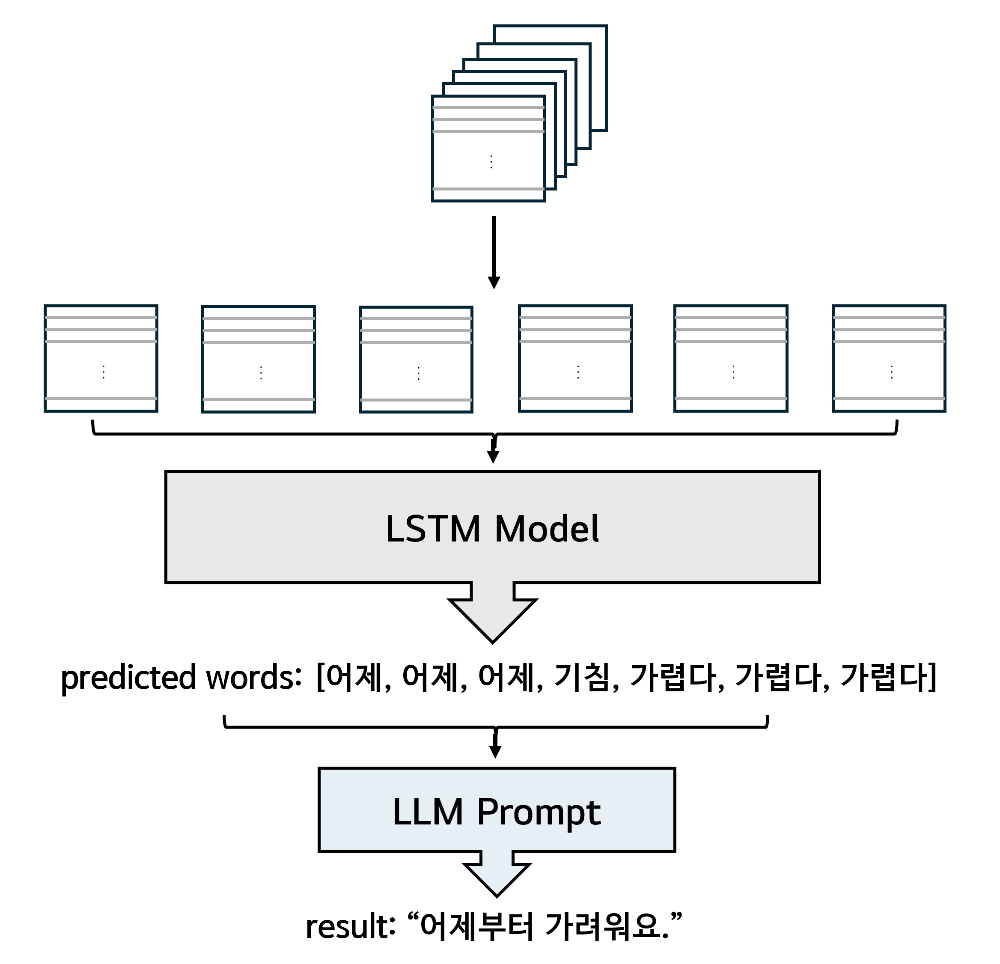
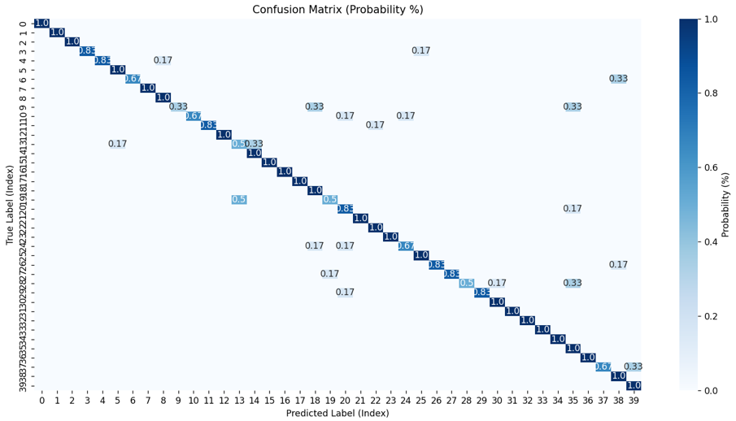

## 수어 인식 LSTM 모델

### 전체 시스템 구조

- sign-language-detect-model
1) Google의 MediaPipe를 활용하여 손과 포즈 랜드마크의 3차원 좌푯값 추출
2) 각 관절 사이의 각도 값을 계산하여 생성한 2차원 데이터를 시퀀스(시계열) 데이터로 변환 후 LSTM 레이어를 통한 수어 단어 학습
3) 촬영한 테스트 데이터를 바탕으로 모델 평가

- android-sign-language-detector
4) LSMT 모델을 TensorFlow Lite로 변환하여 Android 환경에 포팅
5) 모델을 통해 인식된 수어를 ChatGPT API를 통하여 자연스러운 문장으로 변환
6) TTS(Text to Speech)로 의료진에게 음성으로 전달

### 활용한 랜드마크

### 학습 데이터 구조

- 손의 21개의 랜드마크와 포즈의 21개의 랜드마크 좌푯값 추출
- arccos 함수를 이용해 각 관절 사이의 각도를 계산
- 좌푯값과 각도값을 합한 총 234개의 피처에 레이블을 추가해 총 235개의 피처를 2차원 배열 형태로 매 프레임마다 추출
- 학습에 용이하도록 3차원 시퀀스 형태의 데이터로 변환

### Data Augmentation
1) Flip - OpenCV의 flip 함수를 사용해 좌우 반전
2) Shift - x, y 좌푯값을 ±10%씩 이동
- 원본 데이터 4배 증강

### 단어 예측 알고리즘

- 사용자가 수어 동작을 시작할 때부터 손을 내린 순간까지의 시퀀스 데이터 생성
- 다수결 투표 방식으로 단어 예측

### 문장 생성 알고리즘

- 모델을 통해 예측된 단어를 예측 리스트에 추가
- 3번 이상 같은 단어를 예측했다면 정답인 것으로 간주
- ChatGPT API를 활용해 자연스러운 문장으로 변환

### 40개 단어 학습 모델 혼동 행렬

